# 👋 Hi, I'm Ankush Singh Bhadauriya

### Full Stack Developer • Software Engineer • Technology Enthusiast

  
  
  

  
  
  
  

 

---

## 👨‍💻 About Me

I'm a **Full Stack Developer** passionate about building scalable, user-focused web applications and solving real-world problems through technology. I enjoy working across the entire development lifecycle — from designing responsive interfaces and developing robust backend systems to managing databases, deploying applications, and working with cloud infrastructure.

I'm particularly interested in **Java Full Stack Development, modern JavaScript/TypeScript ecosystems, cloud technologies, and scalable software architecture**. I believe in continuously learning, experimenting with new technologies, and turning ideas into practical products.

* 🔭 Currently working on **Traffic Management System**
* 🌱 Currently exploring **AWS, Docker & Advanced Java**
* 💻 Interested in **Full Stack Development & Cloud Technologies**
* 💬 Ask me about **Java, JavaScript, TypeScript, React & Node.js**
* 🌐 Portfolio: **[www.iankushsingh.in](https://www.iankushsingh.in)**
* 📫 Email: **[bhadauriyaankushsingh3@gmail.com](mailto:bhadauriyaankushsingh3@gmail.com)**

 

---

## 🛠️ Tech Stack

### 🌐 Frontend Development

  
  
  
  
  
  

### ⚙️ Backend Development

  
  
  
  

### 🗄️ Databases

  
  

### ☁️ Cloud, DevOps & Deployment

  
  

### 🔧 Development Tools

  
  
  

### ☕ Specialization

  

## 🌐 Connect With Me

 

---

## 📊 GitHub Statistics

 

---

### 💻 Building. Learning. Creating. 🚀

**Thanks for visiting my profile!**

